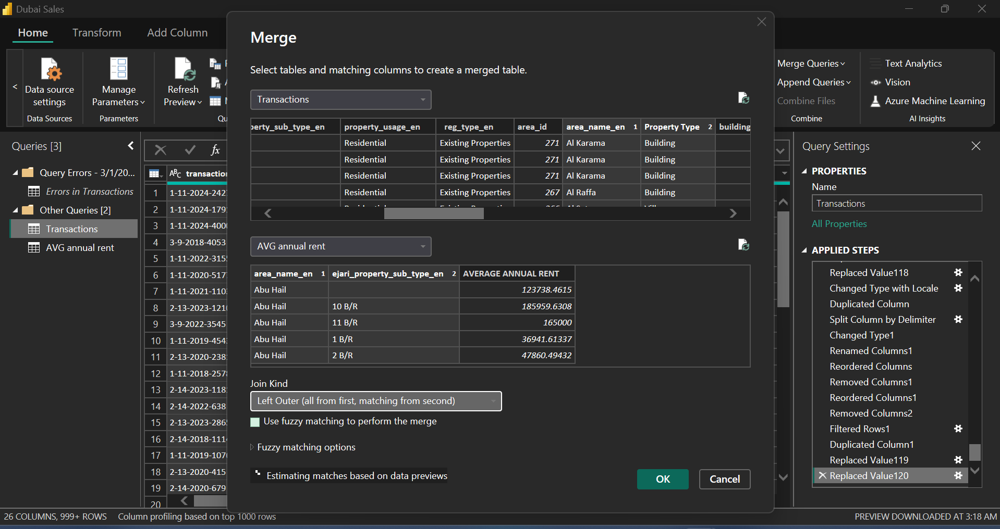

# Dubai Property Sales Analysis (2018 – 2024)

## Project Overview  

This Power BI dashboard offers a detailed analysis of Dubai’s property market from 2018 to 2024. It presents key insights into revenue distribution, transaction types, property categories, and return on investment (ROI). The dashboard is intended to help investors, stakeholders, and tenants make data-driven decisions.

## Problem Statement

Dubai’s real estate market has been experiencing dynamic fluctuations influenced by economic factors, tourism, and infrastructural developments. Investors, stakeholders, and tenants require a comprehensive data visualisation tool to analyse property sales trends, revenue distribution, and ROI across various property types and locations. This project aims to:  

- Identify key revenue-generating areas and property categories.  
- Understand transaction trends based on registration and transaction groups.  
- Evaluate the profitability and ROI of distinct property types.  
- Provide historical trends to support investment decisions.

## Skills/ Concepts Demonstrated

The following Power BI features were incorporated, and Figma was used to wireframe the dashboard:
-	Bookmarking
-	DAX,
-	Quick measure,
-	Calculated measure,
-	Merge Queries,
-	Page Navigation,
-	Modelling,
-	Filter,
-	Drilldown
-	Merge Column
-	Replace Value
-	Button
-	Figma

## Methodology

### Data Source

The dataset for this analysis was sourced from **[Dubai Pulse](https://www.dubaipulse.gov.ae/data/dld-transactions/dld_transactions-open)**, a government-backed data platform that provides real estate transaction records and property insights.

### Data Cleaning & Modelling

Used Power Query to clean and structure data, handling missing values and inconsistencies. Summarised an average rent table from past projects and merged it with the existing table to project the annual ROI per property type across all locations. Established relationships between datasets (property type, transaction type, revenue, yearly rent, ROI, and locations).

Generated Table                 |       Relationship
:------------------------------:|:----------------------------------:
                   |  

## Dashboard

The report comprises 3 pages:
1.	Overview
2.	ROI
3.	Distribution

### Overview

Displays total transactions, total sales revenue, and revenue by landmark, registration type, and transaction group.

___

### ROI

Examines average property price vs. annual rent, revenue by master project, revenue trends by year, and annual rent ROI across property types.

___

### Distribution

Highlights revenue distribution by property type, transaction group, and property usage trends over the years.

___

### Interactive Dashboard

**You can interact with the Power BI Sales [Dashboard](https://app.powerbi.com/reportEmbed?reportId=0564f6d4-cde5-414a-9414-a189f69555a6&autoAuth=true&ctid=a8eec281-aaa3-4dae-ac9b-9a398b9215e7) for more insights and drill-down. Master Project, Area name and Year filter are available on the Dashboard to narrow down your search.**

## Key Insights

### For Investors:
- **High ROI Properties**: Workshops (21.22%), Shops (20.93%), and Clinics (17.67%) yield the highest annual rent ROI.
- **Top Revenue Generating Locations**: Burj Al Arab (22.54%), Downtown Dubai (16.85%), and Burj Khalifa (15.74%) are the top-performing locations.
- **Growth in Mortgages**: Mortgage-based transactions constitute 37.61% of total transactions, indicating increasing investment via financing.
- **Steady Market Growth**: Revenue trends show a significant increase from 2021 to 2024, with total revenue reaching **3 trillion AED**.

### For Stakeholders:
- **Transaction Trends**: Existing property sales dominate (78.53%) compared to off-plan properties (21.47%).
- **Revenue by Transaction Type**: Sales transactions account for 55.76% of the total, followed by mortgages (37.61%) and gifts (6.63%).
- **Master Projects Contribution**: Palm Jumeirah, Business Bay, and Burj Khalifa lead in revenue contribution, showcasing prime investment opportunities.
- **Diversity in Property Types**: Apartments (1 B/R, 2 B/R, 3 B/R) and Villas generate significant revenue, highlighting strong demand in residential properties.

### For Tenants:
- **Affordable Property Options**: 1 B/R and 2 B/R properties show high transaction volumes, making them viable choices for rental accommodation.
- **Annual Rent Trends**: The analysis of average property price vs. Annual rent assists tenants in understanding rental affordability.
- **Residential vs. Commercial Usage**: Residential properties dominate the transaction volume, but commercial properties like offices and warehouses offer high ROI for business tenants.

## Relationship Between Key Metrics

- **Revenue & Landmark Proximity**: Properties near iconic landmarks, such as Burj Khalifa and Downtown Dubai, generate higher revenues.
- **Property Type & ROI**: Certain property types, including workshops and shops, yield better rental income, making them attractive for investment.
- **Transaction Type & Revenue Growth**: Sales and mortgages drive market expansion, with mortgages showing a steady increase.
- **Historical Trends & Future Growth**: Revenue trends indicate sustained market growth, with a notable increase following 2021.

## Conclusion & Recommendations

- **For Investors**: Concentrate on high-ROI property types (workshops, shops, clinics) and prime locations.
- **For Stakeholders**: Keep an eye on mortgage trends as a key indicator of market stability and growth.
- **For Tenants**: Evaluate affordability trends and location-based price variations prior to leasing or purchasing.
- **For Policymakers**: Promote infrastructure development in emerging areas to balance investment distribution.
